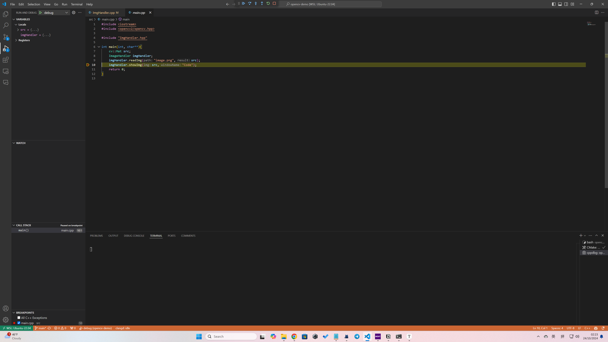
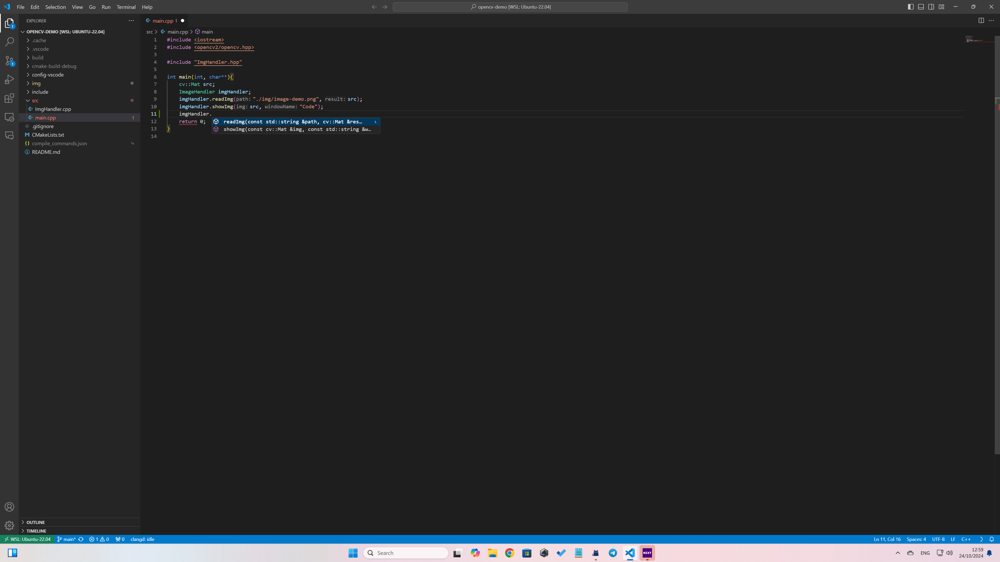

# CMake + vcpkg环境安装指南

wsl用户建议vscode，其他用户**建议clion**。本文档会分别进行说明。

# Genaral

1. 在命令行中执行

```bash
sudo apt update
sudo apt-get install cmake make gcc gdb libdrm-dev libxxf86vm-dev libxt-dev xutils-dev flex bison xcb libx11-xcb-dev libxcb-glx0 libxcb-glx0-dev xorg-dev libxcb-dri2-0-dev libtool autoconf zip unzip git pip vim gnome-shell-extensions tweak curl gperf libegl1-mesa-dev nasm autoconf-archive libdbus-1-dev
```

1. 在[nas](nas.artinx.club)上的/SynoDrive/00_视觉共享文件夹/EnvSetup路径下找到vcpkg_downloads_x64.zip，点击下载。
2. 在github中搜索vcpkg，clone到本地任意一个文件夹下。
3. cd 进 vcpkg 文件夹。执行git checkout 2023.01.09 。
4. 执行./bootstrap-vcpkg.sh。等待一会
5. 将下载的vcpkg_downloads_x64.zip移动到vcpkg 文件夹内进行解压
6. 在vcpkg目录下，执行

```bash
./vcpkg install opencv4
```

这个过程需要比较久。vcpkg会自动下载并编译opencv源码。

> 如遇任何问题，请查找错误提示中的报错日志文件，根据报错信息用包管理器补足缺少的软件包或更换网络~~(魔法上网)~~重试一次

当命令行出现类似

```bash
set(OpenCV_DIR "${VCPKG_INSTALLED_DIR}/x64-linux/share/opencv4")
find_package(OpenCV REQUIRED)
```

字样时，说明安装完成。

1. 在~/.bashrc(或者~/.zshrc，如果你知道自己在做什么的话)中添加这样一行

```bash
export VCPKG_ROOT=<path_to_vcpkg>/scripts/buildsystems/vcpkg.cmake
```

# VSCode

## WSL（optional）

1. 如果你正在使用windows/wsl，请在windows中安装vscode
2. 进入windows中的vscode，点击左边的拓展图标
3. 在上方的搜索框中输入”remote development”。点击第一个进行安装


1. 点击左侧的小电脑图标，点击wsl进入。
2. 此时左下角显示的内容应该带有WSL字样。

## MacOS/Linux/WSL

1. 安装C/C++拓展
2. 将提供的demo clone下来

```bash
git clone https://github.com/ARTINX/opencv-demo.git
```

1. 创建.vscode文件夹，将config-vscode中的文件复制过去
2. 按照注释修改.vscode/tasks.json中的CMAKE_TOOLCHAIN_FILE项
3. 此时，vscode左侧“运行”一栏应该会出现debug字样。此时可以正常进行断点调试。

（断点调试：通过在代码的某一行打上断点，让代码停在某一行。）



## Optional: 代码报错/高亮工具: clangd

1. apt安装clangd, llvm, clang
2. vscode安装clangd插件
3. reload vscode窗口（ctrl+shift+p, 搜索reload window）
4. 按ctrl-shift-B进行构建。构建完成后，在项目路径下执行

```bash
ln -s cmake-build-debug/compile_commands.json .
```

1. 此时你的vscode应该能够正常提示/显示报错



<br></br>

# CLion

TODO