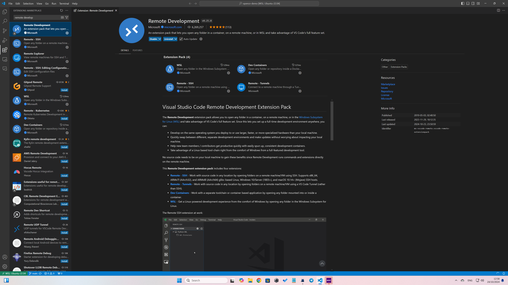

# 仓库目录结构
```markdown
.
|-- calibration 相机标定文件
|   |-- test.yaml 标定测试文件
|   |-- <序列号>.yaml [自行添加]经相机标定后获得的，属于特定工业相机的相机标定文件
|-- config 配置文件
|   |-- hik_camera.conf 海康相机配置文件
|-- config-vscode VSCode配置
|   |-- launch.json 调试配置文件
|   |-- tasks.json 任务配置文件
|-- img 图像文件夹（用于文件注释）
|-- include 头文件
|-- src 源代码
|-- .clang-format C/C++格式化配置文件
|-- .gitignore Git忽略配置文件
|-- CMakeLists.txt
|-- main.cpp
|-- project.md
|-- README.md
```
# 你的任务

见`./project.md`.

作业提交邮箱有改动，务必注意

> 文件中的 `Ref: <path>` 为队内自瞄项目`aritnx-hub` [https://mirrors.sustech.edu.cn/git/artinx/artinx-hub] `<path>` 路径下相关功能模块，仅供参考
> 
> 鼓励参看其他RoboMaster视觉自瞄开源项目，可在 [https://bbs.robomaster.com/] 以自瞄，视觉等关键词查找。

# How to Run

## 环境安装指南(CMake + vcpkg)

wsl用户建议vscode，其他用户**建议clion**。本文档会分别进行说明。

### Genaral

1. 在命令行中执行

```bash
sudo apt update
sudo apt-get install cmake make gcc gdb libdrm-dev libxxf86vm-dev libxt-dev xutils-dev flex bison xcb libx11-xcb-dev libxcb-glx0 libxcb-glx0-dev xorg-dev libxcb-dri2-0-dev libtool autoconf zip unzip git pip vim gnome-shell-extensions tweak curl gperf libegl1-mesa-dev nasm autoconf-archive libdbus-1-dev
```

1. 在[nas](https://nas.artinx.club)上的/SynoDrive/00_视觉共享文件夹/EnvSetup路径下找到vcpkg_downloads_x64.zip，点击下载。如果你使用的是mac，请忽略。
2. 在github中搜索vcpkg，clone到本地任意一个文件夹下。
3. cd 进 vcpkg 文件夹。执行git checkout 2023.01.09 。
4. 执行./bootstrap-vcpkg.sh。等待一会
5. 将下载的vcpkg_downloads_x64.zip移动到vcpkg 文件夹内进行解压
6. 在vcpkg目录下，执行

```bash
./vcpkg install opencv4[contrib,ffmpeg]
```

这个过程需要比较久。vcpkg会自动下载并编译opencv源码。

> 如遇任何问题，请查找错误提示中的报错日志文件，根据报错信息用包管理器补足缺少的软件包或更换网络~~(魔法上网)~~重试一次

当命令行出现类似

```bash
set(OpenCV_DIR "${VCPKG_INSTALLED_DIR}/x64-linux/share/opencv4")
find_package(OpenCV REQUIRED)
```

字样时，说明安装完成。

#### 在命令行中运行

1. 使用cmake构建项目
```
# 在opencv-demo中执行
mkdir build
cd build
cmake .. -DCMAKE_TOOLDCHAIN_FILE=<PATH-TO-YOUR-VCPKG>/scripts/buildsystems/vcpkg.cmake
```

2. 编译

```
make
```

接下来，你应该能够在opencv-demo/build目录下看到一个二进制文件。

### VSCode

请先参考General部分的内容。

#### WSL（optional）

1. 如果你正在使用windows/wsl，请在windows中安装vscode
2. 进入windows中的vscode，点击左边的拓展图标
3. 在上方的搜索框中输入”remote development”。点击第一个进行安装



1. 点击左侧的小电脑图标，点击wsl进入。
2. 此时左下角显示的内容应该带有WSL字样。

#### MacOS/Linux/WSL

1. 安装C/C++拓展
2. 将提供的demo clone下来

```bash
git clone https://github.com/ARTINX/opencv-demo.git
```

1. 创建.vscode文件夹，将config-vscode中的文件复制过去
2. 按照注释修改.vscode/tasks.json中的CMAKE_TOOLCHAIN_FILE项
3. 此时，vscode左侧“运行”一栏应该会出现debug字样。此时可以正常进行断点调试。

（断点调试：通过在代码的某一行打上断点，让代码停在某一行。）


#### Optional: 代码报错/高亮工具: clangd

1. apt安装clangd, llvm, clang
2. vscode安装clangd插件
3. reload vscode窗口（ctrl+shift+p, 搜索reload window）
4. 按ctrl-shift-B进行构建。构建完成后，在项目路径下执行

```bash
ln -s cmake-build-debug/compile_commands.json .
```

1. 此时你的vscode应该能够正常提示/显示报错


<br></br>

### CLion

1. 在[CLion官网](https://www.jetbrains.com/clion/)下载CLion。此时你应该得到一个.tar.gz文件。

2. 解压这个文件，进入bin文件夹，执行./clion.sh。

3. 在[JetBrain官网](https://www.jetbrains.com/community/education/#students)中认证学生身份。南科大在读学生能够免费使用JetBrain旗下的所有IDE。

4. 在general步骤中的vcpkg文件夹下打开命令行，执行`./vcpkg integrate install`。将输出的-D参数复制下来。


4. 用CLion打开克隆的项目。依次选择`File | Settings | Build, Execution, Deployment | CMake`。在CMake options中添加复制下来的参数。

5. 点击右上角的绿色箭头。此时你的CLion应该能够正常编译并运行项目。


## (Optional) WSL 连接USB设备

参见微软官方文档 https://learn.microsoft.com/zh-cn/windows/wsl/connect-usb

## 运行程序

1. 将得到的相机标定文件`<序列号>.yaml`放入`./calibration`中
2. 在`.vscode/launch.json`中配置运行任务需要加载的config相对路径（如`"config/hik_camera.conf"`）并确认相关config的内容(如加载的`exposureTime`和`gain`值)
   > 绝对路径：绝对路径是从文件系统的根目录开始，提供文件或目录的完整定位。
   >
   > 相对路径：相对路径是相对于当前工作目录的路径。
3. 编译和运行项目


# 源代码注释

### src/HikDriver.cpp

海康相机驱动类，通过对海康工业相机的SDK的调用实现调用海康工业相机。
详见代码内注释

### src/ImgHandler.cpp

图片处理类，现有在本地读取图片方法和显示图片方法


### src/utils.cpp

工具函数集合，包含项目中常用的辅助函数.